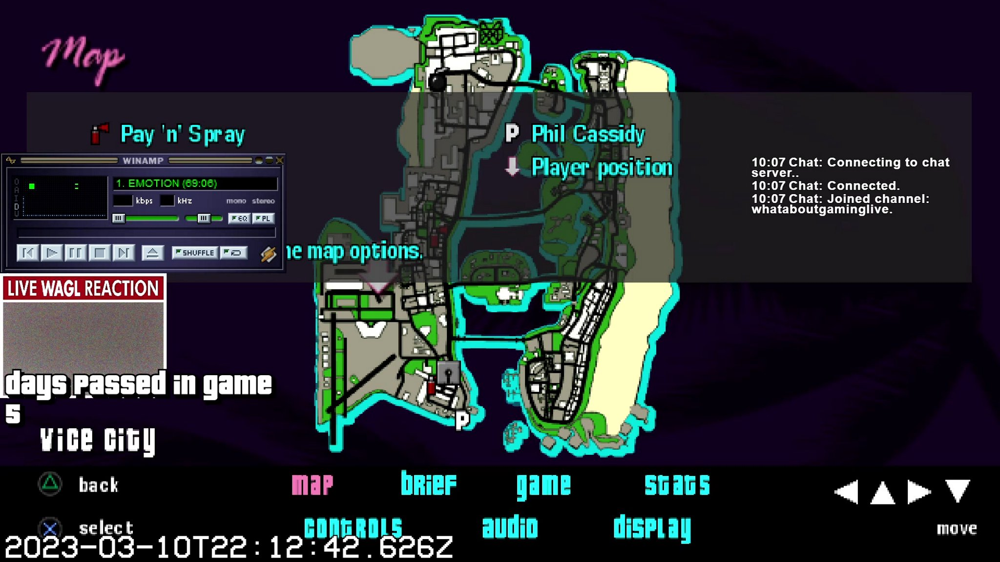
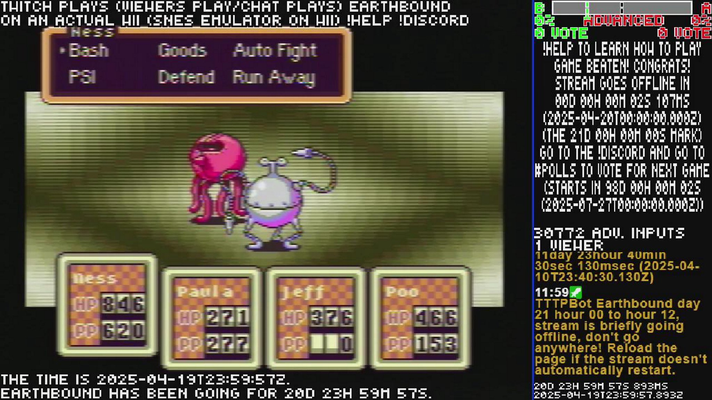

# twitch-metadata-downloader
Node.js application used to mass download metadata and thumbnails for Twitch VODs and Clips. Yes I made this after Twitch announced that they were nuking VODs.

Everything is done via config files, there's ``global.json`` and ``twitch_credentials.json``. ``global.json`` is where a list of channels goes, videos and clips whose metadata you want to download. ``twitch_credentials.json`` is where your Twitch credentials go, stuff such as Client ID, Client Secret, Client Access Token, User ID, Channel name, and scopes (Scopes is currently unused), read notes to see how to generate a new token. You have to make sure ``use_twitch_api`` is always set to ``true`` before running the app.

# Notes
1) Type is either ``Video`` or ``Clip``.
2) Categories are not available on the metadata provided by Twitch, categories had to be entered manually, so there may be some inaccuracies when it comes to categories.
3) Some videos were streamed under multiple categories (or games), videos that have multiple categories will have multiple ``Category`` tags, one per line.
4) Some videos had to be upscaled to 1280x720 (720p) or 1920x1080 (1080p) before being uploaded to YouTube to avoid being downscaled by YouTube. Videos smaller than 1280x720 (720p) but larger than 853x480 (16:9) or 640x480 (4:3) (480p) will get downscaled by YouTube to 480p, and native video resolution will not be available. This will be indicated by the tag ``Upscaled`` in the description.
5) Some videos are stuck at non-native resolution. This will be indicated by the tag ``Non-native``.
6) Videos that are upscaled will have a link to both an upscaled and a non-upscaled YouTube upload. (Again, non-native resolution videos on YouTube will have lower quality and lower resolution.)
7) At some point, Twitch mass converted videos to a newer format. Some videos unfortunately were broken during this conversion process, rendering the videos unwatchable on Twitch. Broken videos can be identified by an incredibly low resolution, and often very long portions of just black screen and silence. This will be indicated by the tag ``Broken Video`` in the description.
8) Not all videos or clips have chat logs available, especially really old videos from before Twitch began saving chat logs to videos. This will be indicated by the tag ``Missing Chat Log``.
9) Chat logs are not exactly human readable. To generate videos of chat logs, use the app [TwitchDownloader](https://github.com/lay295/TwitchDownloader).
10) Not all videos have thumbnails, sometimes Twitch fails to generate thumbnails. This will be indicated by the tag ``Missing Thumbnail``.
11) In some cases, lower video ID will have newer date that some videos with higher ID.
12) Metadata and thumbnails were downloaded using the app [Twitch Metadata Downloader](https://github.com/WhatAboutGaming/twitch-metadata-downloader).
13) Some videos are split in multiple parts, those videos will be indicated by the tags ``Split Video`` and ``Parts``.
14) Some videos are completely missing but the metadata still exists, those videos will be indicated by the tag ``Missing Video``
15) All videos will have the link to the original video hosted on Twitch, but those links might not work.
16) This list is incomplete, there are many videos that were lost to time before this list was compiled. Some lost videos might still exist on YouTube but their video IDs and dates are unknown.
17) All videos in this list are hosted on [this YouTube Channel](https://www.youtube.com/@ItsMeWaggle/videos).
18) Filenames follow this naming convention: {{TimeInMilliseconds}}\_{{Year}}\_{{Month}}\_{{Day}}T{{Hour}}\_{{Minute}}\_{{Second}}Z\_{{ChannelID}}\_{{VideoID}}
19) Some clips don't match the date of the stream they are from, clips can be created years after a stream has ended.
20) Some videos might have wrong ID or title, that's because videos have been erroneously uploaded with the wrong title or video ID, but multiple copies of the same video with the right ID exist.
21) Some videos with different IDs might be duplicates and videos with the same ID might also be duplicates because videos have been uploaded multiple times to YouTube.

[Test 1](docs/CONTRIBUTING.md).

|Video|Description|
|:---|:---|
|[YouTube](https://www.youtube.com/watch?v=z5ugGjQSvJo) [Twitch](https://www.youtube.com/watch?v=z5ugGjQSvJo)  |Broadcaster ID: 75974647          Broadcaster: TwitchTriesToPlay Video ID: 2421053683             Type: Video Title: Twitch Plays(Viewers play/Chat plays)Earthbound on an actual Wii(SNES Emulator) day 02 hour 12 to hour 24 type !help to learn how to play Date: 2025-04-03T21:14:07Z        Date Millis: 1745199914000        Duration: 9h26m40s [Original Size Thumbnail](../../../../../39127626/videos/thumbnails_orig/2023/3/1678489206000_2023_03_10T23_00_06Z_39127626_1761452639_videos_thumbnails_orig_thumb1761452639-0x0.jpg)          [1152p Size Thumbnail](../../../../../39127626/videos/thumbnails_1152p/2023/3/1678489206000_2023_03_10T23_00_06Z_39127626_1761452639_videos_thumbnails_1152p_thumb1761452639-2048x1152.jpg) [Metadata](../../../../../39127626/videos/metadata/2023/3/1678489206000_2023_03_10T23_00_06Z_39127626_1761452639_video_metadata.json)                 [Chat Log](../../../../../39127626/videos/chatlogs/2023/3/2023-03-10T23_00_06Z_39127626_1761452639_chat.json) Upscaled: No                Broken Video: No Missing Chat Log: No           Missing Thumbnail: No Non-native: No              Split Video: No               Parts: 1 Missing Video: No              Clip Creator Name: Name Clip Creator ID: ID
|[YouTube](https://www.youtube.com/) [Twitch](https://www.twitch.tv/videos/2437551761)  |Broadcaster ID: 75974647          Broadcaster: twitchtriestoplay Video ID: 2437551761             Type: archive Title: Twitch Plays(Viewers play/Chat plays)Earthbound on an actual Wii(SNES Emulator) day 21 hour 00 to hour 12 type !help to learn how to play Date: 2025-04-19T23:59:58Z        Date Millis: 1745107198000        Duration: 30s [Original Size Thumbnail](../../../../../75974647/videos/thumbnails_orig/2025/4/1745107198000_2025_04_19T23_59_58Z_75974647_2437551761_videos_thumbnails_orig_thumb0-0x0.jpg)          [1152p Size Thumbnail](../../../../../75974647/videos/thumbnails_1152p/2025/4/1745107198000_2025_04_19T23_59_58Z_75974647_2437551761_videos_thumbnails_1152p_thumb0-2048x1152.jpg) [Metadata](../../../../../75974647/videos/metadata/2025/4/1745107198000_2025_04_19T23_59_58Z_75974647_2437551761_video_metadata.json)                 [Chat Log](../../../../../75974647/videos/chatlogs/2025/4/2025-04-19T23_59_58Z_75974647_2437551761_chat.json) Upscaled: No                Broken Video: No Missing Chat Log: No           Missing Thumbnail: No Non-native: No              Split Video: No               Parts: 1 Missing Video: No
|[YouTube Upscaled](https://www.youtube.com/watch?v=z5ugGjQSvJo) [YouTube Not Upscaled](https://www.youtube.com/watch?v=z5ugGjQSvJo) [Twitch](https://www.youtube.com/watch?v=z5ugGjQSvJo)   |Broadcaster ID: 75974647          Broadcaster: TwitchTriesToPlay Video ID: 2421053683             Type: Video Category: GAME TITLE OR SOMETHING OTHER IDK Category: GAME TITLE OR SOMETHING OTHER IDK Original Title: Twitch Plays(Viewers play/Chat plays)Earthbound on an actual Wii(SNES Emulator) day 02 hour 12 to hour 24 type !help to learn how to play YouTube Title: SHORT VIDEO TITLE IDK LOL Date: 2025-04-01T11\:59\:59Z        Date Millis: 1745199914000        Duration: 9h26m40s [Original Size Thumbnail](https://static-cdn.jtvnw.net/twitch-clips-thumbnails-prod/RudeJoyousHeronSoBayed-tDPEY_exduyTyLFQ/5195bf04-c7b6-4c7b-9bba-b527651bcacb/preview-0x0.jpg)          [1152p Size Thumbnail](https://static-cdn.jtvnw.net/twitch-clips-thumbnails-prod/RudeJoyousHeronSoBayed-tDPEY_exduyTyLFQ/5195bf04-c7b6-4c7b-9bba-b527651bcacb/preview-2048x1152.jpg) [Metadata](https://www.youtube.com/watch?v=z5ugGjQSvJo)                 [Chat Log](https://www.youtube.com/watch?v=z5ugGjQSvJo) Upscaled: Yes                Broken Video: No Missing Chat Log: No           Missing Thumbnail: No Non-native: No              Split Video: Yes               Parts: 5 Missing Video: No              Clip Creator Name: Name Clip Creator ID: ID

|Video|Description|
|:---|:---|
|[YouTube Upscaled]({{ytlink_upscaled}}) [YouTube Not Upscaled]({{ytlink_not_upscaled}})   |Broadcaster ID: {{channel_id}}          Broadcaster: {{channel_name}} Video ID: {{video_id}}             Type: {{video_type}} Category: CATEGORY HAS TO BE ENTERED MANUALLY Original Title: {{video_title}} YouTube Title: {{video_id}} {{video_date}} {{video_title}} Date: {{video_date}}        Date Millis: {{video_date_millis}}        Duration: {{video_duration}} [Original Size Thumbnail]({{thumb_link_orig}})          [1152p Size Thumbnail]({{thumb_link_1152p}}) [Metadata]({{metadata_link}})                 [Chat Log]({{chat_log_link}}) Upscaled: No                Broken Video: No Missing Chat Log: No           Missing Thumbnail: No Non-native: No              Split Video: No               Parts: 1 Missing Video: No              Clip Creator Name: {{clip_creator_name}} Clip Creator ID: {{clip_creator_id}}
